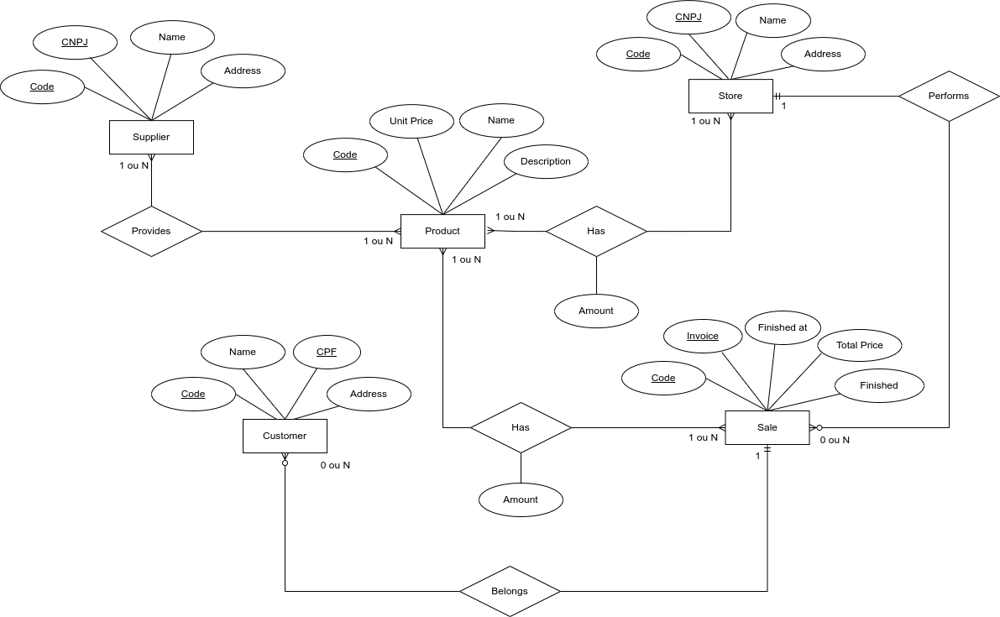
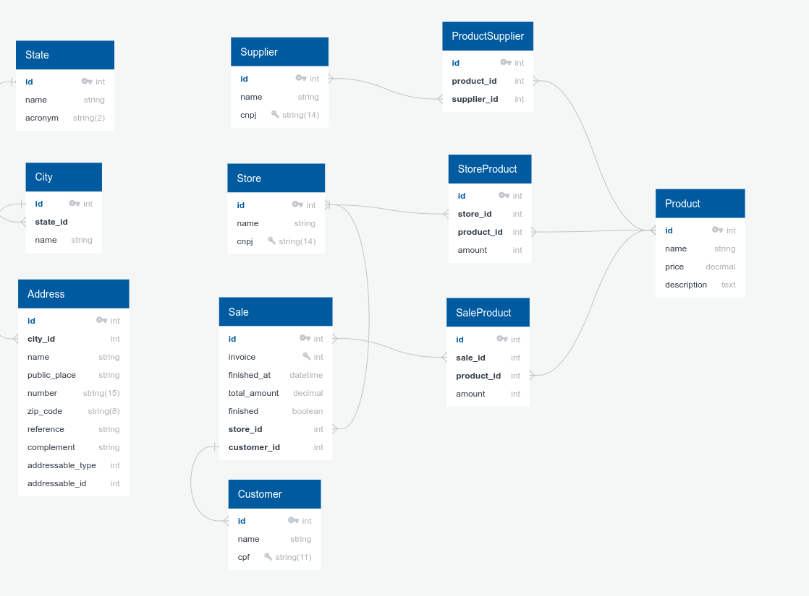
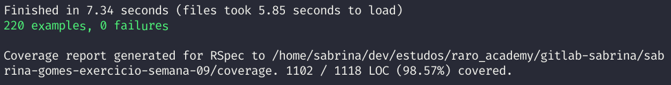

- [Raro Geek Store - Banco de Dados](#raro-geek-store---banco-de-dados)
  - [Objetivos](#objetivos)
  - [Formato de entrega](#formato-de-entrega)
  - [Tomadas de Decisão](#tomadas-de-decisão)
    - [Diagrama Entidade-Relacionamento | Diagrama Lógico Relacional](#diagrama-entidade-relacionamento--diagrama-lógico-relacional)
    - [SGBD | Dependências](#sgbd--dependências)
    - [Inicialização do projeto | Migrations e seus modificadores](#inicialização-do-projeto--migrations-e-seus-modificadores)
    - [Associações e Validações nos Models](#associações-e-validações-nos-models)
    - [Scopes e Callbacks nos Models](#scopes-e-callbacks-nos-models)
    - [Seeds](#seeds)
    - [Testes - Bônus](#testes---bônus)
    - [Desafios e dificuldades](#desafios-e-dificuldades)
  - [Setup](#setup)

# Raro Geek Store - Banco de Dados

Projeto de modelagem de banco de dados incluindo models, migrations e seus modificadores, associações de relacionamentos, validações, scopes e callbacks. Teve como base o problema apresentado no exercício da semana 09 da turma de Ruby on Rails - Raro Academy, que teve "Models" como tema.

## Objetivos

Tendo como base o [enunciado do exercício](./.gitlab/enunciado.md), os objetos são:

- [x] Elaborar Diagrama Entidade Relacionamento;
- [x] Elaborar Diagrama Lógico Relacional;
- [x] Inicializar corretamente um projeto Rails;
- [x] Utilizar modificadores para as colunas definidas nas migrations;
- [x] Utilizar corretamente as referências para outras tabelas;
- [x] Adicionar/atualizar as associações nos models, acrescentando as opções que julgarem necessário;
- [x] Inserir validações nos models (desde que haja relevância para determinado model);
- [x] Inserir callbacks nos models (desde que haja relevância para determinado model);
- [x] Inserir scopes nos models (desde que haja relevância para determinado model);
- [x] Realizar fluxo de trabalho com criação de issues/branches no gitlab;
- [x] Criar seed para popular a base de dados com dados iniciais;
- [x] Documentar as tomadas de decisão.

## Formato de entrega

Conforme solicitado no enunciado do exercício, o fluxo de trabalho foi feito utilizando _issues_ e _branches_ no Gitlab. As _issues_ foram utilizadas para organizar o passo a passo do exercício e para nomeação das _branches_.

Foi criado esse [template](./.gitlab/issue_templates/template.md) baseado nesse [artigo](https://www.pullrequest.com/blog/writing-a-great-pull-request-description/) para auxiliar na descrição do MR. A listagem das issues criadas pode ser visualizada [aqui](./.gitlab/issues.md). E abaixo pode ser visto como o board de _issues_ foi utilizado.


## Tomadas de Decisão

Para melhor organização, as etapas do projeto foram separadas nos subtópicos que seguem, detalhando tomadas de decisão, recursos utilizados e passo a passo.

### Diagrama Entidade-Relacionamento | Diagrama Lógico Relacional

- **Diagrama Entidade-Relacionamento**
  Na relação entre Supplier e Product foi estabelecida uma relação chamada "Provides", onde 1 ou N suppliers podem fornecer 1 ou N products. Sendo assim, está estabelecida uma relação de "muitos-para-muitos". O mesmo tipo de relação foi estabelecida entre Store e Products, onde Store possui 1 ou N Products, porém como é necessário armazenar a quantidade de Products que uma Store possui, foi adicionado o atributo "Amount" na relação entre essas duas entidades.
  Tanto Store como Products também possuem relação com a entidade Sale. Esses relacionamentos foram definidos da seguinte forma:

  - 1 Store realiza 0 ou N Sale;
  - 1 ou N Product possui 1 ou N Sale.

  Sale, por sua vez, se relaciona com a entidade Customer da seguinte forma:

  - Sale pertence a 1 Customer;
  - Customer pertence a 0 ou N Sale.

  O Diagrama Entidade-Relacionamento foi criado utilizando a ferramenta [Drawio](https://www.drawio.com/). O resultado pode ser visualizado abaixo. O arquivo em formato _.drawio_ pode ser acessado [aqui](./.gitlab/raro_geek.drawio)



- **Diagrama Lógico Relacional**

  Nessa etapa, inicialmente foi definido que a tabela Address iria existir com as informações de todos os endereços, mas as entidades que possuem endereço como atributo que iriam guardar a _foreign key_ de Address. Posteriormente, seguindo o conselho realizado na monitoria do dia 08/05, a tabela Address foi transformada em uma entidade polimórfica.
  Além disso, nesse diagrama também podem ser visualizadas as tabelas intermediárias criadas a partir das relações _muito-para-muitos_: ProductSupplier, StoreProduct e SaleProduct.

  Foi criado utilizando o site [QuickDBD](https://www.quickdatabasediagrams.com/) e o resultado está abaixo, mas pode ser conferido também diretamente na plataforma utilizada, através desse [link](https://app.quickdatabasediagrams.com/#/d/I7fGtx).

  

### SGBD | Dependências

Como na atividade anterior já foi utilizado o MySQL, dessa vez foi escolhido o PostgreSQL com o objetivo de experimentar um SGBD diferente. Foi utilizada a gem [Faker](https://github.com/faker-ruby/faker) para geração de informações para popular o banco de dados.

Foi utilizada também a gem [Rubocop-Rails](https://github.com/rubocop/rubocop-rails), que ajudou bastante no desenvolvimento do código. O comando `rubocop -A` foi rodado sempre após criar uma nova migration (e antes executa-la) e nas atualizações realizadas nos models. Alguns escopos foram desabilitados e podem ser conferidos nesse [arquivo](./.rubocop.yml).

- Outras gems utilizadas:

  - [Byebug](https://github.com/deivid-rodriguez/byebug)
  - [Factory Bot Rails](https://github.com/thoughtbot/factory_bot_rails)
  - [Shoulda-Mathcers](https://github.com/thoughtbot/shoulda-matchers)
  - [Simplecov](https://github.com/simplecov-ruby/simplecov)

### Inicialização do projeto | Migrations e seus modificadores

O projeto foi inicializado usando o comando: `rails new raro_geek_store -d postgresql -j esbuild -c tailwind`.
O passo seguinte foi configurar o PostgreSQL, inicialmente utilizando apenas login e senha, mas posteriormente foram configuradas variáveis de ambiente para acesso no arquivo `database.yml` :

```ruby
username: <%= ENV['POSTGRES_USER'] %>
password: <%= ENV['POSTGRES_PASSWORD'] %>
host: <%= ENV['POSTGRES_HOST'] %>
```

Após a inicialização do projeto os models começaram a ser criados e as migrations por consequência. Nesse ponto foi utilizado o Diagrama Lógico Relacional para basear quais tabelas deveriam ser criadas primeiro de acordo com suas relações. As referências das tabelas, atributos e seus tipos foram passados no comando de criação.

Alguns modificadores foram utilizados, entre eles:

- **limit** - 255 para string padrão e valores personalizados para os campos necessários como CNPJ, CPF, invoice, etc;
- **null** - false para todos os campos, exceto _complement_ e _reference_ da tabela Addresses e _finished_at_ da tabela Sales;
- **unique** - definido como true para os campos CPF, CNPJ e invoice;
- **default** - definido como 0 para coluna _amount_ da tabela StoreProducts e definido como 1 para coluna _amount_ da tabela SaleProducts (para uma venda existir precisa ter pelo menos 1 produto).

Durante essa etapa foram realizadas algumas alterações, como a adição e renomeação de colunas, inclusão de constraint e remoção de valor default.

### Associações e Validações nos Models

Em cada model foi adicionado suas associações de relacionamento. Nesse ponto, o Diagrama Lógico Relacional serviu mais uma vez como apoio para visualização melhor das estruturas das tabelas. Foi utilizado o _inverse_of_ e _dependet destroy_ em algumas associações e _through_ nas tabelas intermediárias.

As validações foram adicionadas em cada coluna de cada tabela, exceto nas colunas que armazenam _foreign keys_. Seguem alguns tipos de validações utilizadas: _length_; _presence_; _inclusion_ (para valores boleanos); _numeracality_ com parâmetros e _uniqueness_.

### Scopes e Callbacks nos Models

- **Scopes**
  Ao iniciar a identificação das _queries_ que possivelmente seriam mais utilizadas, foi percebido que algumas se repetiram para busca do campo "name" que está presente em algumas tabelas. Por isso, foi criado um módulo chamado de "NameScopes". Esse módulo está "include" em todos os models que contém "name", dessa forma os scopes declarados em "NameScopes" ficam disponíveis automaticamente.

- **Callbacks**
  Foi levado em consideração algumas regras de negócios identificadas no enunciado para implementação dos callbacks, são elas:

  1. Cada loja pode vender todos ou alguns dos produtos cadastrados;
  2. Cada loja deve realizar o controle de estoque, ou seja, controlar a quantidade disponível para os produtos que ela vende;
  3. Um produto poderá ser vendido apenas se a loja possui-lo e se a quantidade desejada é suficiente;
  4. Após a conclusão de uma venda, os estoques dos produtos para loja precisam ser atualizados.

  Os models _Store_ e _StoreModel_ foram os responsáveis pelo gerenciamento de estoque. Enquanto _Sale_ e _SaleProduct_ foram responsáveis pela regra de negócio de controle de suas próprias vendas.

### Seeds

Como citado anteriormente, foi utilizado a gem Faker para popular o seed da aplicação. Todas as tabelas foram populadas. Abaixo algumas delas podem ser visualizadas. Conectando o banco de dados no [DBeaver](https://dbeaver.io/) ou outro client SQL é possível visualizar todas as tabelas e suas informações.

  <div align="center">
    
    
    
  </div>

### Testes - Bônus

Essa etapa foi iniciada com o intuito apenas de praticar o que foi visto nas últimas aulas. Os primeiros testes foram replicados do que o professor fez em aula, principalmente para os módulos State e City, realizando apenas poucas adaptações. A partir de então foi possível implementar os testes nos demais models, separando por _describes_ de relacionamentos, validações, escopes e callbacks. Em alguns momentos foi utilizado TDD, mas um ponto de melhoria do projeto é a implementação de mais testes para cobertura total da aplicação.



### Desafios e dificuldades

- Um ponto de dificuldade foi a utilização do _git_ de uma forma mais dinâmica. Diferente de como trabalhei com ele no exercício da semana 6, alterando de _branch_ apenas quando todas as implementações fossem finalizadas, dessa vez trabalhei mudando de branches antes de finalizá-las completamente. Por exemplo, enquanto estava trabalhando na _branch_ para desenvolver os callbacks, troquei para _branch_ de teste para tentar implementar callbacks usando TDD. Por isso, em alguns momentos precisei realizar merges entre branches sem passar pela _main_, o que gerou alguns conflitos. Foi um desafio novo tratar esses conflitos do _git_ e que, por consequência, proporcionou uma nova experiência na utilização da ferramenta.

- A implementação dos callbacks foi um ponto de grande dificuldade na execução geral do exercício. Precisei dar alguns passos para trás, compreender melhor as regras de negócio a partir do enunciado, mas ainda assim tive dificuldades para "navegar" entre as relações das tabelas intermediárias, tratar os dados do tipo _float_ e validar o funcionamento das funções implementadas.

## Setup

O projeto foi realizado utilizando as versões:

- ruby 3.2.1;
- rails 7.0.4.3.

Antes de iniciar a aplicação, é necessário exportar as variáveis de ambientes no terminal, de acordo com seu acesso pessoal ao PostgreSQL:

```bash
export POSTGRES_USER=SEU_USUARIO
export POSTGRES_PASSWORD=SUA_SENHA
export POSTGRES_HOST=localhost
```

Recomenda-se também a execução da seguinte sequência de comandos:

```bash
bundle install
rails db:create
rails db:migrate
rails db:seed
```

Para executar os testes, rodar o seguinte comando:

```bash
rspec
```
